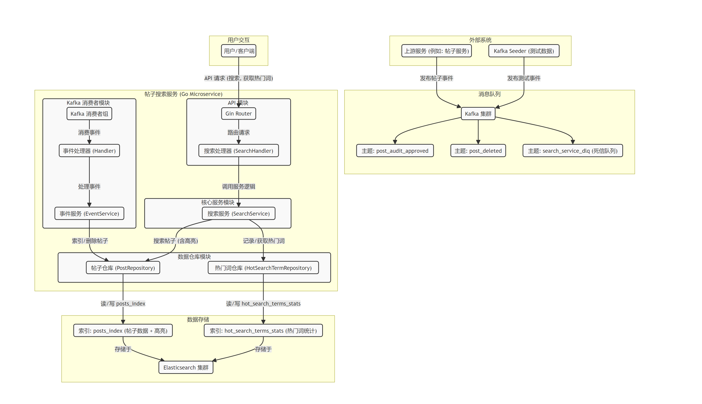

# 帖子搜索服务 (Post Search Service) 🚀

本项目是一个基于 Go 语言构建的帖子搜索微服务，利用 Kafka 作为消息队列处理帖子事件 (创建/更新、删除)，并将数据索引到 Elasticsearch 中以提供强大的搜索功能。服务现在还支持**热门搜索词**展示和搜索结果**关键词高亮**，以提升用户体验。项目包含主应用程序、一个用于生成测试数据的 Kafka Seeder 工具，以及一套完整的 Docker Compose 环境，用于运行 Kafka, Elasticsearch 和相关的可视化工具 (Kafdrop, Kibana)。

## 🎯 系统架构图

下图展示了本服务的主要组件及其交互流程：




## ✨ 项目特性

  * **事件驱动架构** Kafka: 通过 Kafka 处理帖子数据变更事件，实现服务间的解耦。
  * **全文搜索** 🔍: 使用 Elasticsearch 提供高效、灵活的帖子搜索能力。
  * **中文分词** 🇨🇳: Elasticsearch 集成了 IK Analyzer 中文分词插件，优化中文内容的搜索。
  * **热门搜索词** 🔥:
      * 动态记录用户搜索行为，统计搜索词频次。
      * 提供 API 端点 (`/api/v1/search/hot-terms`) 展示热门搜索词，引导用户发现。
  * **搜索结果高亮** ✨:
      * 在搜索结果中返回包含搜索关键词的文本片段。
      * 通过 HTML 标签 (默认为 `<strong>`) 包裹关键词，方便前端实现加粗显示。
  * **Dockerized 环境** 🐳: 使用 Docker Compose 快速搭建和管理本地开发所需的全部服务。
  * **可视化与管理工具** 📊:
      * **Kafdrop**: 用于实时监控 Kafka 主题、消息和消费者组。
      * **Kibana**: 用于可视化探索 Elasticsearch 中的数据、执行查询和分析。
  * **配置管理** ⚙️: 通过 YAML 文件 (`config.development.yaml`) 进行应用和各组件的配置，支持多索引配置。
  * **日志与追踪** 📝:
      * 集成 Zap Logger 进行结构化、高性能的日志记录。
      * 集成 OpenTelemetry (当前配置为标准输出)，为将来的分布式追踪打下基础。
  * **API 文档** 📖: 通过 Swagger (OpenAPI) 自动生成并提供交互式 API 文档。

## 🛠️ 技术栈

  * **后端**: Go (Golang)
  * **HTTP 框架**: Gin
  * **消息队列**: Apache Kafka (KRaft 模式)
  * **搜索引擎/数据库**: Elasticsearch
  * **Kafka 客户端 (Go)**: Sarama (`github.com/IBM/sarama`)
  * **Elasticsearch 客户端 (Go)**: `github.com/elastic/go-elasticsearch/v8`
  * **容器化**: Docker, Docker Compose
  * **中文分词**: IK Analysis Plugin for Elasticsearch
  * **Kafka 可视化**: Kafdrop
  * **Elasticsearch 可视化/管理**: Kibana
  * **配置加载**: Viper (通过 `go-common/core.LoadConfig` 间接使用)
  * **日志**: Zap Logger
  * **API 文档**: Swaggo (`github.com/swaggo/swag`)

## 📁 项目结构 (核心部分)

```

post\_search/
├── assets/                     \# 新增：存放图片等静态资源
│   └── capture\_20250605004914097.png \# 您的架构图
├── cmd/
│   ├── main.go                 \# 主应用程序入口
│   └── kafka\_seeder/
│       └── main.go             \# Kafka 测试数据生成器
├── config/
│   ├── config.development.yaml \# 开发环境配置文件
│   ├── es.go                   \# Elasticsearch 配置结构体定义 (支持多索引)
│   ├── kafka.go                \# Kafka 配置结构体定义
│   └── postConfig.go           \# 主应用配置结构体
├── constants/
│   └── service.go              \# 服务名等常量
├── docs/                       \# Swagger 自动生成的文档
│   ├── docs.go
│   ├── swagger.json
│   └── swagger.yaml
├── internal/
│   ├── api/                    \# API 处理器 (HTTP Handlers - Gin)
│   │   └── handlers.go
│   ├── core/                   \# 核心组件封装
│   │   ├── es/
│   │   │   └── client.go       \# Elasticsearch 客户端初始化及索引管理
│   │   └── kafka/              \# Kafka 相关核心逻辑
│   │       ├── client.go       \# Sarama 配置
│   │       ├── consumer\_group.go \# Kafka 消费者组封装
│   │       ├── event\_service.go  \# Kafka 事件处理业务逻辑
│   │       ├── handler.go      \# Kafka 消息处理器
│   │       └── producer.go     \# Kafka 生产者 (DLQ)
│   ├── models/                 \# 数据模型 (DTOs)
│   │   ├── api\_dto.go          \# API 请求/响应 DTOs (含 HotSearchTerm)
│   │   ├── es\_dto.go           \# ES 文档模型 (含 EsPostDocument.Highlights, HotSearchTermES)
│   │   └── swagger\_responses.go \# Swagger 辅助响应模型
│   ├── repositories/           \# 数据仓库层
│   │   ├── buildSearchQuery.go \# 构建 ES 查询 DSL (含高亮)
│   │   ├── es\_post.go          \# 帖子数据的 Repository
│   │   └── es\_hot\_terms\_repository.go \# 热门搜索词统计的 Repository
│   └── service/                \# 业务服务层
│       └── search\_service.go   \# 搜索相关业务逻辑 (含热门搜索词)
├── router/
│   └── router.go               \# Gin 路由配置与中间件
├── elasticsearch\_custom/       \# Elasticsearch 自定义 Dockerfile 及 IK 分词器
│   ├── Dockerfile
│   └── elasticsearch-analysis-ik-8.13.4.zip \# IK分词器插件 (需手动下载)
├── go.mod
├── go.sum
├── main.go                     \# (注：主入口通常在 cmd/main.go)
├── docker-compose.yaml         \# Docker Compose 配置文件
└── README.md                   \# 本文档

````

## ⚙️ 环境准备

1.  **Docker 和 Docker Compose**: 确保您的机器上已安装最新版本的 Docker Desktop。
2.  **Go**: 确保已安装 Go 语言环境 (版本请参照 `go.mod` 文件，通常 \>= 1.18)。
3.  **IK 分词器插件**:
      * 访问 [IK Analysis Plugin Releases](https://github.com/infinilabs/analysis-ik/releases) 页面。
      * 下载与 `docker-compose.yaml` 中 Elasticsearch 版本 (当前为 `8.13.4`) **完全对应**的 `elasticsearch-analysis-ik-X.X.X.zip` 文件。
      * 将下载的 ZIP 文件准确放置到项目根目录下的 `elasticsearch_custom/` 文件夹中。

## 🚀 快速开始

1.  **构建并启动 Docker Compose 服务**:
    在项目根目录下打开终端，执行：

    ```bash
    # (推荐) 首次运行或 Dockerfile 更改后，强制重新构建 ES 自定义镜像
    docker-compose build --no-cache elasticsearch

    # 启动所有 Docker 服务
    docker-compose up -d
    ```

    使用 `docker-compose ps` 查看状态，或 `docker-compose logs -f <service_name>` 查看日志。

2.  **运行主应用程序 (`post_search`)**:
    打开新终端，在项目根目录执行 (假设主程序入口是 `cmd/main.go`)：

    ```bash
    go run cmd/main.go -config ./config/config.development.yaml
    ```

3.  **运行 Kafka Seeder (可选)**:
    用于向 Kafka 发送测试帖子数据：

    ```bash
    cd cmd/kafka_seeder
    go run main.go
    ```

    注意 Seeder 配置文件路径。

## 🔗 访问服务和工具

  * **帖子搜索服务 API**:
      * **Swagger UI (API 文档)**: `http://localhost:8083/swagger/index.html` (端口参照 `config.development.yaml` 中的 `server.port`)
      * **健康检查**: `GET http://localhost:8083/api/v1/search/_health`
      * **搜索帖子**: `GET http://localhost:8083/api/v1/search/search?q=关键词`
          * 示例: `http://localhost:8083/api/v1/search/search?q=Go语言&page=1&size=5` (结果中将包含高亮片段)
      * **获取热门搜索词**: `GET http://localhost:8083/api/v1/search/hot-terms?limit=5`
  * **Kafka**: `localhost:9092`
  * **Elasticsearch**: `http://localhost:9200`
  * **Kafdrop (Kafka UI)**: `http://localhost:9000`
  * **Kibana (ES UI)**: `http://localhost:5601`

## Kibana 使用提示

1.  首次访问 Kibana (`http://localhost:5601`)，选择“自行探索”。
2.  左上角菜单 (☰) -\> "Management" -\> "Stack Management"。
3.  "Kibana" -\> "Data Views" (或 "Index Patterns")。
4.  点击 "Create data view"。
      * **主帖子索引**:
          * Name: `posts_index_view`
          * Index pattern: `posts_index` (或您配置的 `primaryIndex.name`)
          * Timestamp field: `updated_at`
      * **热门搜索词索引**:
          * Name: `hot_terms_view`
          * Index pattern: `hot_search_terms_stats` (或您配置的 `hotTermsIndex.name`)
          * Timestamp field: `last_searched_at`
5.  创建后，在菜单 (☰) -\> "Analytics" -\> "Discover" 中切换数据视图查看数据。调整时间范围以确保数据可见。

## ⚠️ 注意事项

  * **IK 分词器版本**: `elasticsearch-analysis-ik-X.X.X.zip` 版本必须与 Elasticsearch 镜像版本严格对应。
  * **Seeder**: `kafka_seeder` 每次运行发送固定数据。
  * **Kafka 消费者偏移量**: 默认 `auto.offset.reset: "latest"`。如需处理旧消息，需调整或重置偏移量。
  * **资源消耗**: Docker Compose 启动的服务（尤其 ES 和 Kafka）资源消耗较大。

## 🔮 未来可改进点 (TODO)

  * ✅ **完善单元测试和集成测试**：特别关注新功能。
  * 📈 **优化 Elasticsearch 查询与映射**:
      * 探索更高级的高亮选项。
      * 研究复杂评分与相关性排序。
  * 📉 **热门搜索词衰减与清理**: 实现不活跃词条的定期清理。
  * 💡 **搜索建议/自动完成**: 基于数据实现搜索框输入建议。
  * 🛠️ **更细致的错误处理与监控**: 增加错误分类、告警和业务指标。
  * 🔒 **安全性增强**: 为API和后端服务添加认证授权 (生产环境)。
  * 🔄 **配置热加载**: 研究服务不重启更新部分配置的方案。


